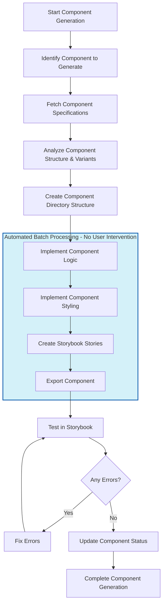

# Components Generation Workflow

This document outlines the orchestration workflow for generating components in the Design 2 Code project. It provides a step-by-step process to guide the component generation from specification to implementation.

## Step 1: Load Rules, Workflows and Implementation Standards

As the first step when triggering the §components:generate workflow, load all relevant documentation to ensure adherence to project standards:

**Required Documentation:**
- Rules:
  - Component rules: `design-2-code-v1-code-agent/rules/030-components.md`
  - General workflow rules: `design-2-code-v1-code-agent/rules/888-workflows.md`
- Implementation standards:
  - Component implementation standards: `design-2-code-v1-code-agent/memory-bank/010-project/031-implementation-standards-components.md`
- Workflow documentation:
  - This component generation workflow: `design-2-code-v1-code-agent/workflows/components-generate.md`

**⚠️ CRITICAL: Always load these documents at the start of the workflow to ensure all implementation follows project standards and rules.**

## Workflow Orchestration

### Step 2: Identify Component to Generate

Ask the user to provide the Figma URL for the component they want to generate. Extract the component name and node ID from the URL.

**User Input Requirements:**
- Figma URL with node ID
- Component name if not derivable from URL

### Step 3: Fetch Component Specifications

Use the MCP Figma Server to fetch the component specifications using the get_design_context tool.

**MCP Tool Configuration:**
- Tool: get_design_context
- Node ID: Extracted from URL or currently selected node
- Client Languages: typescript, scss
- Client Frameworks: react

### Step 4: Analyze Component Structure and Variants

Analyze the fetched specifications to understand the component's structure, variants, properties, and styling requirements.

**Analysis Focus Areas:**
- Component structure and hierarchy
- Variant definitions and states
- Required and optional props
- Visual appearance and styling needs

### Step 5: Create Component Directory Structure

Create the component directory in the designated location following the project's organizational structure.

**Directory Structure:**
- Path: `design-2-code-v1/packages/components-v1/src/[ComponentName]`
- ComponentName: PascalCase format

### Step 6: Implement Component Files

Create all required component files following the implementation standards and rules:
1. Component Logic (TSX)
2. Component Styling (SCSS)
3. Component Usage Example
4. Index File
5. Storybook File (.stories.tsx)

**Reference Documents:**
- Implementation Standards: `design-2-code-v1-code-agent/memory-bank/010-project/031-implementation-standards-components.md`
- Component Rules: `design-2-code-v1-code-agent/rules/030-components.md`

### Step 7: Review and Fix Component Against MCP Design

**⚠️ [SUPER CRITICAL] ⚠️ ALWAYS COMPARE THE GENERATED COMPONENT AGAINST THE MCP DESIGN RESULTS AND FIX ANY GAPS OR ISSUES. THIS STEP MUST NOT BE SKIPPED UNDER ANY CIRCUMSTANCES.**

Perform a detailed comparison between the generated component and the original MCP design specifications:

**Verification Points:**
- Visual fidelity (colors, typography, spacing, dimensions)
- Component structure and hierarchy match the design
- All variants and states are correctly implemented
- Interactive behaviors match design specifications
- Responsive behavior matches design expectations

**Gap Resolution Process:**
1. Document all identified discrepancies
2. Prioritize fixes based on visual and functional impact
3. Implement all necessary adjustments
4. Verify fixes against original MCP design
5. Document any design decisions or technical compromises

### Step 8: Test in Storybook

**⚠️ [SUPER CRITICAL] ⚠️ ALWAYS RUN STORYBOOK AND FIX ISSUES WITHOUT FAIL. THIS STEP MUST NOT BE SKIPPED UNDER ANY CIRCUMSTANCES.**

Test the component in Storybook to verify its appearance, behavior, and variants.

**Verification Checks:**
- Component visibility in Storybook
- All variants display correctly
- Interactive elements function properly
- Responsive behavior
- Accessibility compliance

### Step 9: Fix Any Errors (MANDATORY)

Address any errors identified during testing before considering the component complete.

**Error Resolution Process:**
1. Run build command to identify compilation errors
2. Address all errors following standards and rules
3. Retest to confirm fixes
4. Document any challenges and solutions

**Completion Requirements:**
- All files implemented correctly
- All tests passing
- No errors or warnings
- Documentation complete

## Workflow Completion

Confirm all components have been successfully implemented. If there are more components to process, return to Step 1 and repeat the workflow.

For implementation details, code snippets, and examples, refer to:
`design-2-code-v1-code-agent/memory-bank/010-project/031-implementation-standards-components.md`

For rules, conditions, and requirements, refer to:
`design-2-code-v1-code-agent/rules/030-components.md`