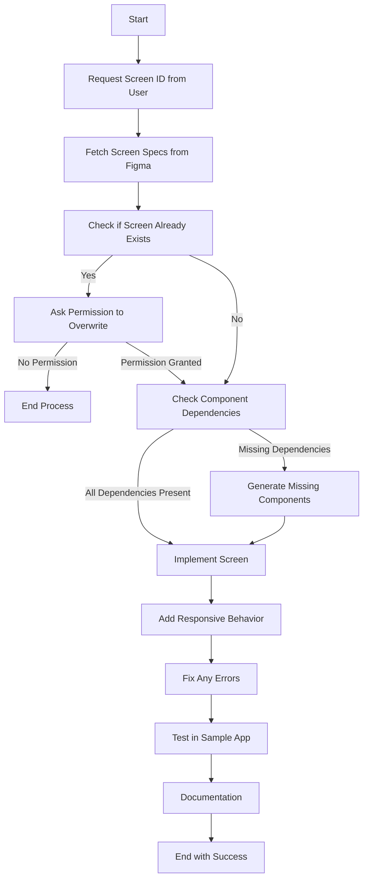

# Screens Generation Workflow

This document outlines the step-by-step workflow for generating screens using the Figma MCP server and implementing them in the Design 2 Code project.

## Step 1: Load Rules, Workflows and Implementation Standards

As the first step when triggering the §screens-generate workflow, load all relevant documentation to ensure adherence to project standards:

**Required Documentation:**
- Rules:
  - Screen rules: `design-2-code-v1-code-agent/rules/050-screens.md`
  - General workflow rules: `design-2-code-v1-code-agent/rules/888-workflows.md`
- Implementation standards:
  - Screen implementation standards: `design-2-code-v1-code-agent/memory-bank/010-project/033-implementation-standards-screens.md`
- Workflow documentation:
  - This screen generation workflow: `design-2-code-v1-code-agent/workflows/screens-generate.md`
  - Component generation workflow (for dependencies): `design-2-code-v1-code-agent/workflows/components-generate.md`

**⚠️ CRITICAL: Always load these documents at the start of the workflow to ensure all implementation follows project standards and rules.**



## Screen Generation Steps

### Step 2: Request Screen ID from User

Before generating a screen, we need to obtain the screen ID from the user:

```
<ask_followup_question>
<question>Please provide the Figma URL of the screen you want to generate.</question>
</ask_followup_question>
```

If the user provides a URL, extract the node ID from it:
- For URLs like `https://www.figma.com/file/abcdefg/FileName?node-id=12345%3A67890`, extract `12345:67890`
- For URLs with `-` format like `https://www.figma.com/file/abcdefg/FileName?node-id=12345-67890`, convert to `12345:67890`

### Step 3: Fetch Screen Specifications Using Figma MCP Tool

Once we have the screen ID, get the Figma MCP tool output:

```
<use_mcp_tool>
<server_name>figma-desktop</server_name>
<tool_name>get_design_context</tool_name>
<arguments>
{
  "nodeId": "[SCREEN_ID]",
  "clientLanguages": "typescript",
  "clientFrameworks": "react"
}
</arguments>
</use_mcp_tool>
```

### Step 4: Check If Screen Already Exists

Before creating any files, check if a screen with the same name already exists in the project:

```
<execute_command>
<command>ls -la design-2-code-v1/packages/screens-v1/src/[ScreenName]</command>
<requires_approval>false</requires_approval>
</execute_command>
```

If the screen already exists, ask the user for permission to overwrite:
```
<ask_followup_question>
<question>A screen named "[ScreenName]" already exists. Would you like to overwrite it with a new implementation?</question>
<options>["Yes, overwrite the screen", "No, cancel the operation"]</options>
</ask_followup_question>
```

### Step 5: Check Component Dependencies

**⚠️ CRITICAL: This step is MANDATORY and must be completed before implementing the screen ⚠️**

Before implementing the screen, verify that all required components exist in the components-v1 package:

1. Analyze the screen specifications to identify all component dependencies:
```
<execute_command>
<command>ls -la design-2-code-v1/packages/components-v1/src</command>
<requires_approval>false</requires_approval>
</execute_command>
```

2. Generate a dependency report listing all required components and their status:

```
# Dependency Analysis Report for [ScreenName]

## Components Required:
- [Component1]: STATUS - [EXISTS/MISSING]
- [Component2]: STATUS - [EXISTS/MISSING]
- [Component3]: STATUS - [EXISTS/MISSING]

## Missing Components:
- [List of missing components]

## Action Required:
[Indicate if any components need to be generated before proceeding]
```

3. If there are missing components, implement them before proceeding:

**For each missing component:**
- Generate the component following the component generation workflow as described in `design-2-code-v1-code-agent/workflows/components-generate.md`
- **All missing dependent components MUST be generated under `design-2-code-v1/packages/components-v1/src`**
- Implement the component according to design specifications
- Fix any errors before proceeding

**For component organization:**
- **Dependent Components**:
  - All dependent components identified in the Figma specification MUST be reused from the components-v1 package
  - If a dependent component doesn't exist, it MUST be generated in `design-2-code-v1/packages/components-v1/src`
- **Screen-Specific (Non-Dependent) Components**:
  - Components that are NOT dependencies but are only needed for a specific screen MUST be created within the screen's components directory
  - Path structure: `design-2-code-v1/packages/screens-v1/src/[ScreenName]/components/[ComponentName]/`
  - Each screen-specific component must have its own directory with:
    - `[ComponentName].tsx` - Component implementation
    - `[ComponentName].css` - Component styles
    - `index.ts` - Export file
  - These screen-specific components should not be placed in the components-v1 package
  - The subfolder structure is specifically for these non-dependent, screen-specific components

```
<ask_followup_question>
<question>The screen implementation requires the following components that are currently missing: [List missing components]. Do you want me to generate these components before proceeding with the screen implementation?</question>
<options>["Yes, generate the missing components first", "No, modify the screen to use only existing components", "Cancel the operation"]</options>
</ask_followup_question>
```

### Step 6: Implement Screen Based on the Figma Design

Implement the screen according to the design specifications:

1. Create the screen directory structure following the hierarchical organization:
   ```
   design-2-code-v1/packages/screens-v1/src/[ScreenName]/
   ├── [ScreenName].tsx
   ├── [ScreenName].css
   ├── index.ts
   ├── components/
   ```

2. For each screen-specific (non-dependent) component:
   - Create a component directory under the components folder
   - Implement the component files ([ComponentName].tsx, [ComponentName].css, index.ts)
   - Follow component implementation standards
   - Note: This is only for components that are NOT dependencies identified in the Figma specification

3. In the main screen file:
   - Define the TypeScript interface for the screen props
   - Import dependent components from components-v1 package
   - Import screen-specific (non-dependent) components from the components directory
   - Implement the screen layout
   - Add responsive behavior
   - Style the screen using CSS

**Note:** Implementation should follow the standards specified in `design-2-code-v1-code-agent/memory-bank/010-project/033-implementation-standards-screens.md`.

#### 6.1 Add Responsive Behavior

Ensure the screen is responsive according to the design specifications:

```css
.screen-name {
  display: flex;
  flex-direction: column;
}

@media (min-width: 768px) {
  .screen-name {
    flex-direction: row;
  }
}

@media (min-width: 1024px) {
  .screen-name {
    max-width: 1200px;
    margin: 0 auto;
  }
}
```

### Step 7: Implement Screen in Sample Application

**⚠️ CRITICAL: All screens MUST be implemented in sample-application-v1 ⚠️**

Ensure that the screens are implemented in the sample-application-v1 project:

1. Import the screen into a new or existing page in the sample application:
```typescript
// In design-2-code-v1/applications/sample-application-v1/src/pages/[screen-name-page].tsx
import { [ScreenName] } from '../../../../packages/screens-v1/src/[ScreenName]';

const [ScreenName]Page = () => {
  return (
    <div>
      <h1>[ScreenName] Example</h1>
      <[ScreenName] {...props} />
    </div>
  );
};

export default [ScreenName]Page;
```

2. Add navigation to the screen in the application:
```typescript
// Update navigation to include the new screen
```

### Step 8: Fix Any Errors (MANDATORY)

**⚠️ CRITICAL: This step is MANDATORY and must be completed before proceeding ⚠️**

If there are any errors during build:
1. Run the build command to check for compilation errors:
```
<execute_command>
<command>cd design-2-code-v1 && pnpm build</command>
<requires_approval>false</requires_approval>
</execute_command>
```

2. Fix all errors following the troubleshooting guidelines in:
`design-2-code-v1-code-agent/memory-bank/010-project/033-implementation-standards-screens.md`

### Step 9: Test in Sample Application (MANDATORY)

**⚠️ CRITICAL: All screens MUST be tested in the sample application ⚠️**

Test the screen in the sample application to verify its integration:

1. Start the sample application to test the screen:
```
<execute_command>
<command>cd design-2-code-v1/applications/sample-application-v1 && pnpm dev</command>
<requires_approval>false</requires_approval>
</execute_command>
```

2. Verify the screen integration:

#### Sample Application Integration Checklist

- [ ] Screen loads correctly in the sample application
- [ ] All components function properly
- [ ] Layout is correct and matches the design
- [ ] Responsive behavior works across different viewport sizes
- [ ] No console errors or warnings appear
- [ ] All interactions work as expected
- [ ] Screen integrates properly with the application flow
- [ ] Performance is acceptable

### Step 10: Update pnpm-lock.yaml

After implementing the screen, update the pnpm-lock.yaml file to ensure all dependencies are correctly tracked:

```
<execute_command>
<command>cd design-2-code-v1 && pnpm install</command>
<requires_approval>false</requires_approval>
</execute_command>
```

## Completion Criteria

A screen is considered complete when:

1. All required files are created and properly implemented with the correct hierarchical structure:
   - Main screen files ([ScreenName].tsx, [ScreenName].css, index.ts) 
   - Screen-specific component directories and files in the components directory
2. The screen builds without errors
3. The screen matches the design specifications
4. All functionality works as expected
5. The screen is responsive and displays correctly at all breakpoints
6. The screen follows all screen rules and implementation standards
7. The screen is successfully integrated and tested in the sample application
8. All dependencies are properly implemented and imported

## Troubleshooting Common Issues

If you encounter issues during the screen generation process:

1. **Build Errors**: Check for TypeScript errors, import issues, or missing dependencies
2. **Styling Issues**: Verify that you're using the correct design tokens and that CSS is properly structured
3. **Component Integration**: Ensure that components are imported and used correctly
4. **Responsive Issues**: Test at different viewport sizes and adjust media queries as needed
5. **Sample Application Integration**: Check import paths and ensure the screen is properly exported